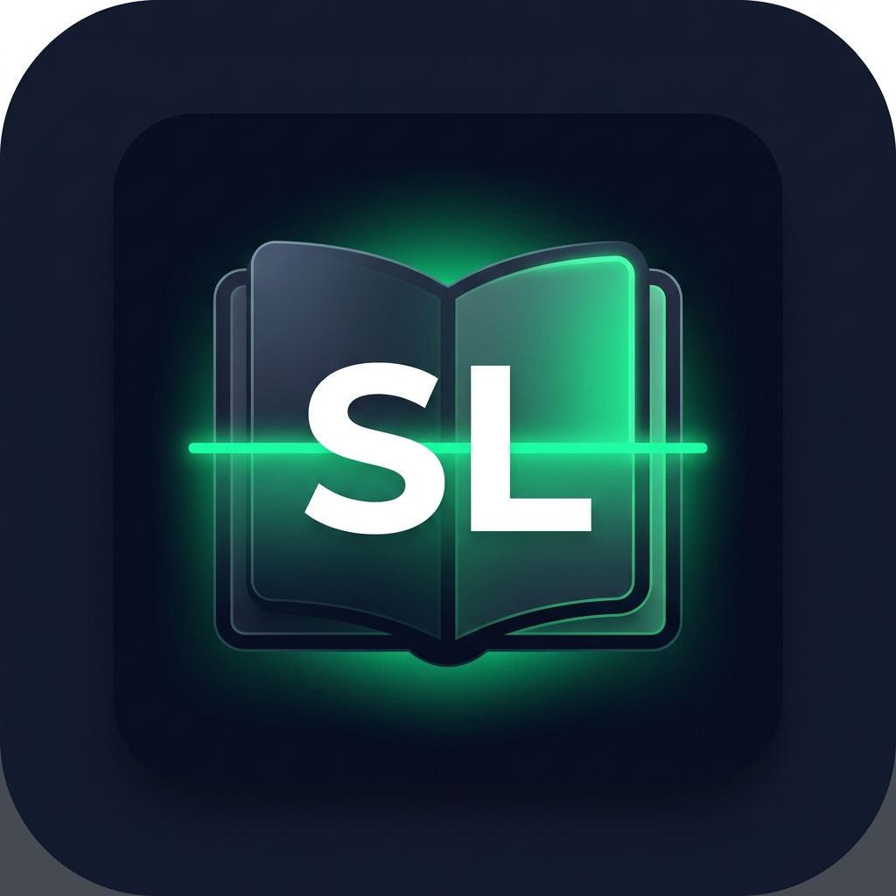

<div align="center">



# ScanLedger

**Gym Revenue Logbook Digitizer**

*Capture · Extract · Confirm · Report*

[](https://expo.dev)
[](https://www.typescriptlang.org)
[](https://supabase.com)
[](LICENSE)

</div>

---

## Overview

ScanLedger is a mobile application designed for gyms that still use handwritten logbooks to record daily attendance and payments. Instead of replacing the existing workflow, it **digitizes revenue records at the end of each day** by photographing the logbook page, extracting payment amounts, and syncing confirmed data to the cloud.

No QR codes. No RFID. No changes to how your gym operates — just smarter bookkeeping.

---

## The Problem

Many small gyms use handwritten logbooks like this:

```
John
Maria - 120
Peter
Carl 100
Anna - 80
```

At the end of every day, staff manually:
- Count payment entries
- Add up the totals
- Record the day's earnings
- Prepare a report for the owner

This is slow, error-prone, and impossible to audit remotely.

---

## The Solution

ScanLedger turns that logbook page into structured digital data in seconds:

| Name  | Amount |
|-------|-------:|
| John  | —      |
| Maria | ₱120   |
| Peter | —      |
| Carl  | ₱100   |
| Anna  | ₱80    |

**Daily Revenue: ₱300**

---

## Features

### Staff
- 📷 **Capture** — Camera with guided viewfinder frame
- 🔍 **Extract** — On-device OCR parses names and payment amounts
- ✏️ **Review** — Edit any mis-detected entry before saving
- ⚠️ **Duplicate Detection** — Flags suspicious repeated entries
- ✅ **Confirm & Save** — Uploads to Supabase with haptic feedback
- 📶 **Offline Mode** — Queues data locally and syncs automatically when back online

### Owner
- 📊 **Dashboard** — Daily, Weekly, Monthly, and Yearly revenue at a glance
- 📈 **Revenue Chart** — 7-day trend line chart
- 📚 **History** — Browse all processed logbooks with staff attribution
- 👥 **Staff Management** — View and manage authorized staff accounts
- ⚙️ **Settings** — Account, device management, and export options

---

## Screenshots

> *(Coming soon — run the app on a device to see it in action)*

---

## Tech Stack

| Layer | Technology |
|---|---|
| Mobile Framework | [React Native](https://reactnative.dev) via [Expo](https://expo.dev) |
| Language | TypeScript |
| Backend | [Supabase](https://supabase.com) (Auth, PostgreSQL, Storage) |
| Navigation | [React Navigation 6](https://reactnavigation.org) |
| Charts | [react-native-chart-kit](https://github.com/indiespirit/react-native-chart-kit) |
| Offline Storage | [@react-native-async-storage/async-storage](https://github.com/react-native-async-storage/async-storage) |
| Camera | [expo-camera](https://docs.expo.dev/versions/latest/sdk/camera/) |
| Animations | [react-native-reanimated](https://docs.swmansion.com/react-native-reanimated/) |

---

## Getting Started

### Prerequisites

- [Node.js](https://nodejs.org) v18+
- [Expo Go](https://expo.dev/go) app on your phone, OR an Android/iOS emulator
- A [Supabase](https://supabase.com) account (free tier works)

### 1. Clone the Repository

```bash
git clone https://github.com/ruselportes/ScanLedger.git
cd ScanLedger
npm install
```

### 2. Set Up Supabase

1. Create a new project at [supabase.com](https://supabase.com)
2. Go to **SQL Editor** and run the schema file:

   > The schema file is **not included in this repo** for security. Contact the project maintainer for the `supabase_schema.sql` file, or refer to the [Database Schema](#database-schema) section below to recreate it.

3. Go to **Project Settings → API** and copy your:
   - Project URL
   - `anon` / public key

### 3. Configure Environment Variables

Create a `.env` file in the project root:

```env
EXPO_PUBLIC_SUPABASE_URL=https://your-project-id.supabase.co
EXPO_PUBLIC_SUPABASE_ANON_KEY=your-anon-key-here
```

> ⚠️ **Never commit `.env` to version control.** It is already excluded via `.gitignore`.

### 4. Create User Accounts

In Supabase → **Authentication → Users**, create:
1. An owner account (e.g., `owner@yourgym.com`)
2. One or more staff accounts

Then in the **SQL Editor**, set the owner's role:

```sql
UPDATE public.profiles SET role = 'owner' WHERE email = 'owner@yourgym.com';
```

### 5. Run the App

```bash
npx expo start
```

Scan the QR code with **Expo Go**, or press `a` for Android / `i` for iOS emulator.

---

## Database Schema

The application uses the following tables in Supabase (PostgreSQL):

```
profiles          → User accounts with role (staff | owner)
logbook_uploads   → Each logbook scan session
logbook_entries   → Individual name/amount rows within a scan
devices           → Registered device records
```

Row Level Security (RLS) is enforced on all tables:
- Staff can only insert and view their own uploads
- Owners have read access to all records
- No public access to any table

---

## Project Structure

```
ScanLedger/
├── App.tsx                          # Root entry point
├── babel.config.js                  # Reanimated plugin config
├── app.json                         # Expo config + permissions
│
└── src/
    ├── theme/index.ts               # Design system (colors, spacing, fonts)
    ├── types/index.ts               # TypeScript interfaces
    ├── context/
    │   └── AuthContext.tsx          # Session persistence + role loading
    ├── services/
    │   ├── supabase.ts              # Supabase client
    │   ├── dataService.ts           # Revenue queries
    │   └── offlineQueue.ts          # Offline sync queue
    ├── utils/
    │   └── parser.ts                # OCR text parser + duplicate detection
    ├── navigation/
    │   ├── RootNavigator.tsx        # Role-based routing
    │   ├── StaffStack.tsx           # Camera → Review → Success
    │   ├── StaffTabs.tsx            # Staff bottom tabs
    │   └── OwnerTabs.tsx            # Owner bottom tabs
    └── screens/
        ├── auth/LoginScreen.tsx
        ├── staff/CameraScreen.tsx
        ├── staff/ReviewScreen.tsx
        ├── staff/UploadSuccessScreen.tsx
        ├── staff/StaffHistoryScreen.tsx
        ├── owner/DashboardScreen.tsx
        ├── owner/OwnerHistoryScreen.tsx
        ├── owner/StaffManagementScreen.tsx
        └── owner/OwnerSettingsScreen.tsx
```

---

## User Roles

| Feature | Staff | Owner |
|---|:---:|:---:|
| Capture logbook page | ✅ | — |
| Review & edit entries | ✅ | — |
| View today's uploads | ✅ | — |
| View revenue dashboard | — | ✅ |
| View full history | — | ✅ |
| Manage staff accounts | — | ✅ |
| Export reports | — | ✅ |

---

## Authentication

ScanLedger uses a **one-time login** model. Once a staff member or owner signs in on a device, their session is securely persisted. They will not be asked to log in again unless they explicitly sign out or change devices.

---

## Offline Support

The app works without an internet connection. When a scan is confirmed offline, it is saved to a local queue on the device. The queue automatically syncs to Supabase the next time the device is online.

---

## Roadmap

- [ ] Real on-device handwriting OCR via ML Kit
- [ ] Image perspective correction & straightening
- [ ] PDF and CSV report export
- [ ] Push notifications for sync events
- [ ] Multi-branch / multi-gym support
- [ ] Advanced revenue analytics

---

## Contributing

This is a private project for gym revenue digitization. For questions or feature requests, contact the maintainer.

---

## License

MIT License — see [LICENSE](LICENSE) for details.

---

<div align="center">

Built with ❤️ by [Rusel Portes](https://github.com/ruselportes)

*ScanLedger v1.0.0 · July 2026*

</div>
